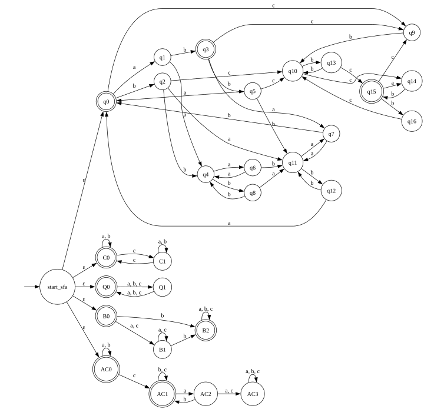

Лабораторная работа 2
 
Условие  
По заданному регулярному выражению построить  
1 ДКА (обосновать минимальность табличкой)  
2 НКА   
3 ПКА  
4 Расширенное регулярное выражение 

А также провести автоматическое тестирование предполагаемой эквивалентности построенных распознавателей. Тем самым необходимо построить алгоритмы, определяющие принадлежность слова языку академического регулярного выражения,
ДКА, НКА и ПКА. (возможно расширенное регулярное выражение)


## Вариант 12

```
((aa|bb)*(ab|ba)(aa|bb)*(ab|ba))*(ab|(bc|cb)(bb)*(cb|bc))*
```
## 1 ДКА
Для построения ДКА можно разбить регулярное выражение на две части   
1 `((aa|bb)*(ab|ba)(aa|bb)*(ab|ba))*`
2 `(ab|(bc|cb)(bb)*(cb|bc))*`
Обе части находятся под влиянием звезды Клини, следовательно они могут или отсуствовать или присуствовать в итоговом слове. Это позволяет сделать вывод о том, что если на вход подаётся вторая часть, например c очевидным cимволом `c` , то попасть в первую часть мы уже не можем. 


Для доказательства минимальности ДКА необходимо использовать таблицу классов эквивалентности, где каждый класс — это новое состояние.


|Состояние| Префиксы\суффиксы  | ε | a | b | ba | ab | bb | bc | aab | bbc | cbc | bba | abba | c |
|---|---|---|---|---|---|---|---|---|---|---|---|---|---|---|
| q0  | __ε__     | 1 | 0 | 0 | 0 | 1 | 0 | 0 | 0 | 0 | 0 | 0 | 1 | 0 |
| q1  | __a__     | 0 | 0 | 1 | 0 | 0 | 0 | 0 | 0 | 0 | 0 | 1 | 0 | 0 |
| q2  | __b__     | 0 | 0 | 0 | 0 | 0 | 0 | 0 | 1 | 0 | 1 | 0 | 0 | 0 |
| q3  | __ab__    | 1 | 0 | 0 | 1 | 1 | 0 | 0 | 0 | 0 | 0 | 0 | 0 | 0 |
| q4  | __bb__    | 0 | 0 | 0 | 0 | 0 | 0 | 0 | 0 | 0 | 0 | 0 | 1 | 0 |
| q5  | __abb__   | 0 | 1 | 0 | 0 | 0 | 0 | 0 | 1 | 0 | 1 | 1 | 0 | 0 |
| q6  | __bba__   | 0 | 0 | 0 | 0 | 0 | 0 | 0 | 0 | 0 | 0 | 1 | 0 | 0 |
| q7  | __aba__   | 0 | 0 | 1 | 0 | 0 | 0 | 0 | 1 | 0 | 0 | 0 | 0 | 0 |
| q8  | __bbb__   | 0 | 0 | 0 | 0 | 0 | 0 | 0 | 1 | 0 | 0 | 0 | 0 | 0 |
| q9  | __c__     | 0 | 0 | 0 | 0 | 0 | 0 | 0 | 0 | 1 | 0 | 0 | 0 | 0 |
| q10 | __cb__    | 0 | 0 | 0 | 0 | 0 | 0 | 1 | 0 | 0 | 0 | 0 | 0 | 0 |
| q11 | __ba__    | 0 | 0 | 0 | 1 | 1 | 0 | 0 | 0 | 0 | 0 | 0 | 0 | 0 |
| q12 | __bab__   | 0 | 1 | 0 | 0 | 0 | 0 | 0 | 1 | 0 | 0 | 1 | 0 | 0 |
| q13 | __cbb__   | 0 | 0 | 0 | 0 | 0 | 0 | 0 | 0 | 1 | 0 | 0 | 0 | 1 |
| q14 | __cbc__   | 0 | 0 | 1 | 0 | 0 | 0 | 0 | 0 | 0 | 0 | 0 | 0 | 0 |
| q15 | __cbbc__  | 1 | 0 | 0 | 0 | 1 | 0 | 0 | 0 | 0 | 0 | 0 | 0 | 0 |
| q16 | __cbbcb__ | 0 | 0 | 0 | 0 | 0 | 0 | 0 | 0 | 0 | 1 | 0 | 0 | 0 |


## 2 НКА

Так как в регулярном выражении две части, то можно использовать эпсилон-переход из стартового состояния в 1 или 2 часть при этом, если переход идёт во вторую часть, то возврата в стартовое состояние быть не может, а если в первую, то можем вернуться для новой итерации.

1 и 2 части регулярного выражения
1 `((aa|bb)*(ab|ba)(aa|bb)*(ab|ba))*`
2 `(ab|(bc|cb)(bb)*(cb|bc))*`



Табличка

| Префиксы\суффиксы | ε | a | b | ba | ab | bb | bc | aab | bbc | cbc | bba | abba | c |
|-------------------|---|---|---|---|---|---|---|---|---|---|---|---|---|
| __ε__ | 1 | 0 | 0 | 0 | 1 | 0 | 0 | 0 | 0 | 0 | 0 | 1 | 0 |
| __a__ | 0 | 0 | 1 | 0 | 0 | 0 | 0 | 0 | 0 | 0 | 1 | 0 | 0 |
| __b__ | 0 | 0 | 0 | 0 | 0 | 0 | 0 | 1 | 0 | 1 | 0 | 0 | 0 |
| __ab__ | 1 | 0 | 0 | 1 | 1 | 0 | 0 | 0 | 0 | 0 | 0 | 0 | 0 |
| __abb__ | 0 | 1 | 0 | 0 | 0 | 0 | 0 | 1 | 0 | 1 | 1 | 0 | 0 |
| __aba__ | 0 | 0 | 1 | 0 | 0 | 0 | 0 | 1 | 0 | 0 | 0 | 0 | 0 |
| __c__ | 0 | 0 | 0 | 0 | 0 | 0 | 0 | 0 | 1 | 0 | 0 | 0 | 0 |
| __bс__ | 0 | 0 | 0 | 0 | 0 | 0 | 0 | 0 | 0 | 0 | 0 | 0 | 0 |
| __bcb__ | 0 | 0 | 0 | 0 | 0 | 0 | 0 | 0 | 1 | 0 | 0 | 0 | 1 |

## 3 ПКА
Что такое ПКА: у нас есть главный автомат, который читает слово. В какой-то момент он переключается на дочерний автомат, который проверяет условие, которое должно быть. Если дочерний автомат достигает принимающего состояния, главный автомат продолжает работу. Если нет — слово отвергается.
Дочерние автоматы могут быть связаны ветвлениями типа и или типа или. В моём случае будет типа И. Для этого можно проанализировать регулярку и выделить несколько её особенностей:

1 количество букв с тоже должно быть чётным 
2 чётная длина всего слова 
3 хотя бы одна буква `b` в непустом слове 
4 после `с` не может идти `а`, только `ab`

Табличка:

| Префиксы\суффиксы | ε | a | b | aba | bba | bab | cbc |
|-------------------|---|---|---|---|---|---|---|
| __ε__ | 1 | 0 | 0 | 0 | 0 | 0 | 0 |
| __a__ | 0 | 0 | 1 | 0 | 1 | 1 | 0 |
| __b__ | 0 | 0 | 0 | 1 | 0 | 0 | 1 |
| __aba__ | 0 | 0 | 1 | 1 | 0 | 1 | 0 |
| __abb__ | 0 | 1 | 0 | 0 | 1 | 1 | 1 |
| __bab__ | 0 | 1 | 0 | 0 | 1 | 1 | 0 |
| __bcc__ | 0 | 0 | 1 | 0 | 0 | 1 | 0 |


## 4 Расширенное регулярное выражниие

    ^(
    (
    ((aa)?(bb)?)+
        (	((?=(ab))[^c][^c])
        |
        ((?=(ba))[^c][^c])
        )
    ((aa)?(bb)?)+
        (	([^c][^c](?<=(ab)))
        |
        ([^c][^c](?<=(ba)))
        )
    )?
    )+(
    (
        ((?=ab)[^c][^c])
        |
        ( (((?=(bc))[^a][^a])
        |
        ((?=(cb))[^a][^a])
        )
        ((bb)?)+
        ( ([^a][^a](?<=(bc)))
        |
        ([^a][^a](?<=(cb)))
        )
    )
    )? 
    )+$


1) `((aa)?(bb)?)+` Под бесконечной положительной итерацией итерируются подслова, которые могут быть пустыми. Вся эта часть может начаться и заканчиваться как `aa`, так и `bb`, благодря операции `?`.
2) ```
    (	
        ((?=(ab))[^c][^c]) 
	    |
	    ((?=(ba))[^c][^c]) 
    )

Мы проверяем, что последовательность из двух букв, не являющихся `c`, начинается с `ab`, либо с `ba`. Не имеет значения, находится ли операция `|` внутри условия (для компактной записи) или снаружи (для софистицированной записи).

3) ```
    (
        ([^c][^c](?<=(ab)))
        |
        ([^c][^c](?<=(ba)))
    )

Аналогично случаю 2, последовательность из двух букв, не являющихся `c`, заканчивается либо с `ab`, либо с `ba`.

4) ```
    (
        (((?=(bc))[^a][^a])
        |
        ((?=(cb))[^a][^a]))
    )

Аналогично случаю 2 проверяется, что последовательность из двух букв, не являющихся `a`, начинается с `bc`, либо с `cb`.

5) Запись `((bb)?)+` позволяет бесконечно итерировать `bb`, даже если будет итерировать пустое подслово.

6) ```
    (	
        ((?=(bc))[^a][^a]) 
	    |
        ((?=(cb))[^a][^a])
    )


Аналогично случаю 3 проверяется, что последовательность из двух букв, не являющихся `a`, заканчивается либо с `bc`, либо с `cb`.

