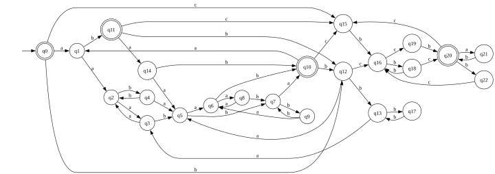

Лабораторная работа 2

Провести автоматическое тестирование предполагаемой эквивалентности построенных распознавателей. Тем самым необходимо построить алгоритмы, определяющие принадлежность слова языку академического регулярного выражения,
ДКА, НКА и ПКА.
Эквивалентность расширенного регулярного выражения тестировать не обязательно, но если сделаете распознаватель для таких выражений, то будет добавлен
дополнительный балл. Если не делаете, то для расширенного регулярного выражения достаточно описать содержательно (полуформально), почему оно должно распознавать тот же самый язык.
Требуется только фазз-тестирование эквивалентности: строится случайное
слово ω и проверяется, принадлежит ли он языкам регулярного выражения, ДКА,
НКА и ПКА согласованно.


Вариант 12

```
((aa|bb)*(ab|ba)(aa|bb)*(ab|ba))*(ab|(bc|cb)(bb)*(cb|bc))*
```


